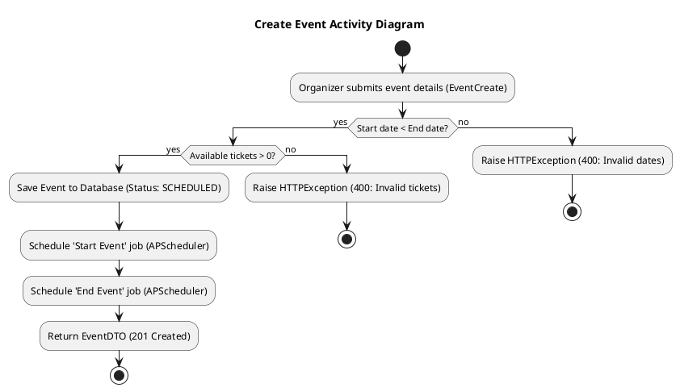
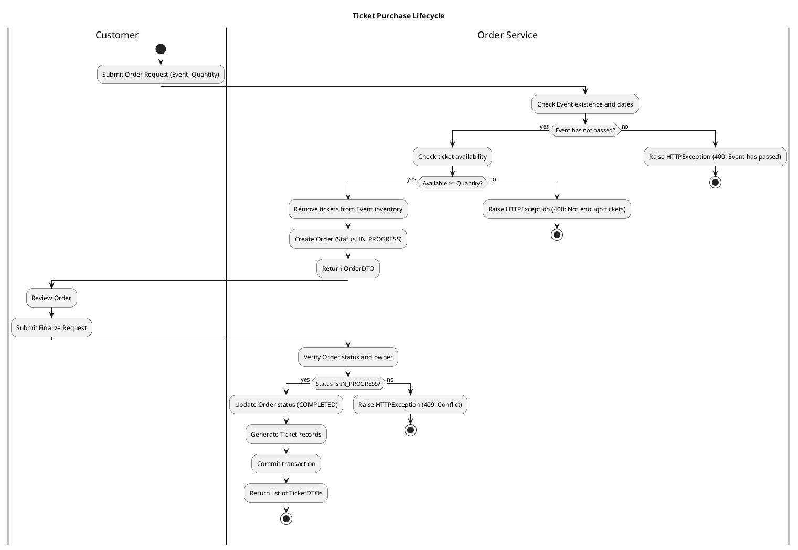
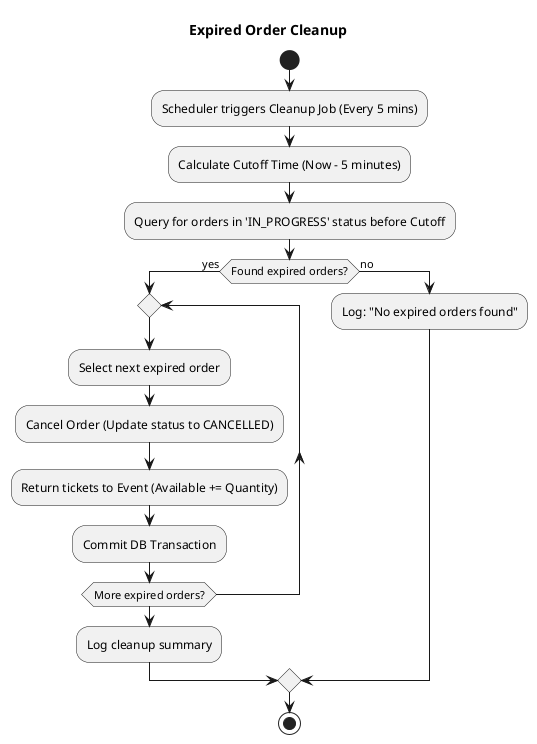

# Activity Diagrams

This document contains Activity Diagrams representing the operational flows of the "You Want Ticket" system using PlantUML.

## 1. Create Event Process
This diagram shows the steps taken by an organizer to create a new event, including validation and scheduling.

---

## 2. Ticket Purchase Lifecycle
This diagram illustrates the two-step process: creating an initial order and then finalizing it to receive tickets.

---

## 3. Expired Order Cleanup (Background Task)
This background process ensures that tickets held by unfinalized orders are released back to the event inventory after a timeout.

### Key Workflow Principles
- **Inventory Locking:** Tickets are temporarily "locked" (removed from inventory) as soon as an order is created to prevent overbooking.
- **Fail-Safe Cleanup:** The background cleanup service prevents permanent loss of inventory from abandoned or timed-out carts.
- **Atomic Operations:** Most service actions are wrapped in transactions (commit/rollback) to ensure data consistency.
