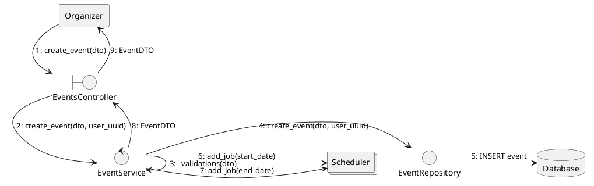

# Communication Diagrams

This document contains Communication Diagrams (Collaboration Diagrams) for key workflows in the "You Want Ticket" system.

## 1. Create Event Workflow
This diagram illustrates the interaction between components when an organizer creates a new event.



---

## 2. Create and Finalize Order Workflow
This diagram illustrates the process of a customer placing an order and then finalizing it to receive tickets.

```plantuml
@startuml
skinparam monochrome true

agent Customer
boundary OrdersController
control OrderService
control EventService
control TicketService
entity OrderRepository
database Database

== Create Order ==
Customer -> OrdersController : 1: POST /orders/
OrdersController -> OrderService : 2: create_order(dto, user_uuid)
OrderService -> EventService : 3: get_event_by_uuid(event_uuid)
OrderService -> EventService : 4: remove_available_tickets(event_uuid, count)
OrderService -> OrderRepository : 5: create_order(dto, user_uuid)
OrderRepository -> Database : 6: INSERT order (IN_PROGRESS)
OrderRepository -> OrderRepository : 7: commit()
OrderService --> OrdersController : 8: OrderDTO
OrdersController --> Customer : 9: OrderDTO (201 Created)

== Finalize Order ==
Customer -> OrdersController : 10: PUT /orders/{uuid}/finalize
OrdersController -> OrderService : 11: finalize_order_by_user(uuid, user_uuid)
OrderService -> OrderRepository : 12: finalize_order_by_user(uuid, user_uuid)
OrderRepository -> Database : 13: UPDATE order status (COMPLETED)
OrderService -> TicketService : 14: create_tickets(list[TicketCreate])
TicketService -> Database : 15: INSERT tickets
OrderRepository -> OrderRepository : 16: commit()
OrderService --> OrdersController : 17: list[TicketDTO]
OrdersController --> Customer : 18: list[TicketDTO] (200 OK)
@enduml
```

### Key Interactions
- **Validation:** `OrderService` validates event availability through `EventService` before proceeding.
- **Transaction Management:** `OrderRepository` (via the service) manages `commit()` and `rollback()` calls to ensure data integrity.
- **Service Orchestration:** `OrderService` coordinates between `EventService`, `TicketService`, and its own repository.
