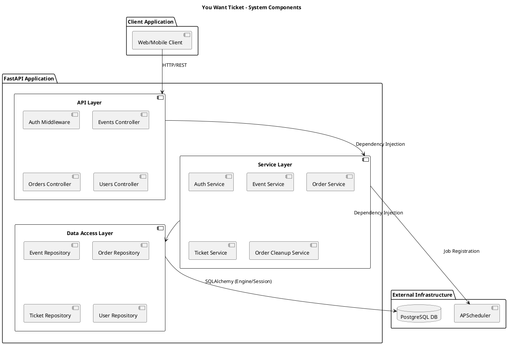
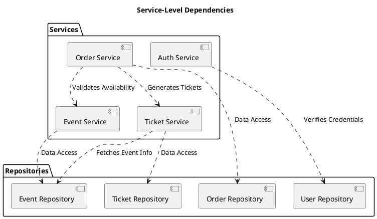

# Component Diagrams

This document illustrates the structural architecture of the "You Want Ticket" system using PlantUML Component Diagrams.

## 1. High-Level System Components
The system is divided into three primary layers: the **API Layer** (FastAPI), the **Service Layer** (Business Logic), and the **Infrastructure Layer** (Data Access and External Services).

---

## 2. Service-Level Dependencies
This diagram shows how individual services collaborate to fulfill complex business processes, such as order finalization.

### Component Breakdown
- **API Layer:** Handles request routing, parameter validation (via Pydantic), and HTTP response formatting. It is the entry point for all external traffic.
- **Service Layer:** The core of the application. It orchestrates business processes and ensures that complex operations (like decrementing inventory and creating an order) are executed within a consistent transaction.
- **Data Access Layer (DAL):** Encapsulates SQLAlchemy logic, keeping the service layer decoupled from the specific ORM implementation and SQL queries.
- **Infrastructure:**
    - **APScheduler:** An in-process scheduler used for time-sensitive tasks like automatically starting/ending events or cleaning up expired orders.
    - **PostgreSQL:** The persistent data store for all entities (Events, Users, Orders, Tickets).
