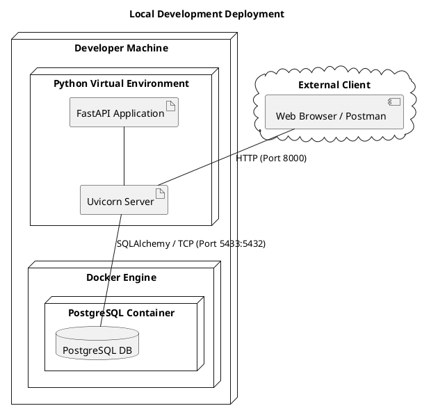
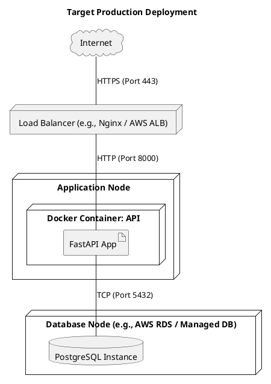

# Deployment Diagrams

This document illustrates the physical deployment architecture of the "You Want Ticket" system using PlantUML Deployment Diagrams.

## 1. Local Development Deployment
The current development environment uses a combination of a locally running FastAPI application and a containerized PostgreSQL database.

---

## 2. Typical Production Deployment (Target)
A standard production deployment would typically involve a container orchestration platform (like Kubernetes or Docker Swarm) with a load balancer.

### Deployment Details
- **Environment Management:** Python dependencies are managed within a virtual environment (`.venv`), and configuration is handled via Pydantic Settings, which reads from environment variables.
- **Containerization:** The PostgreSQL database is containerized for easy setup and consistency across development machines.
- **Networking:** In local development, the application connects to the database via `localhost:5433`. In a containerized or production environment, this would typically point to a service name (e.g., `db:5432`) or a managed database endpoint.
- **Scalability:** The stateless nature of the FastAPI application allows it to be easily scaled horizontally behind a load balancer.
