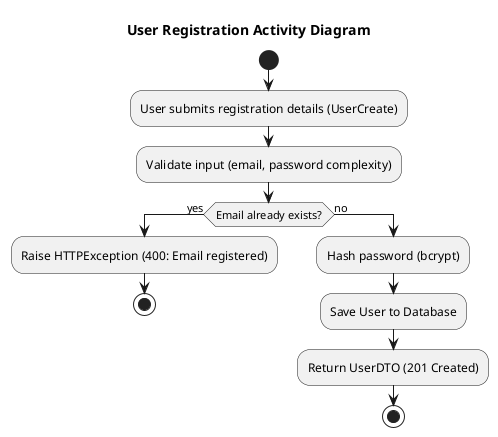
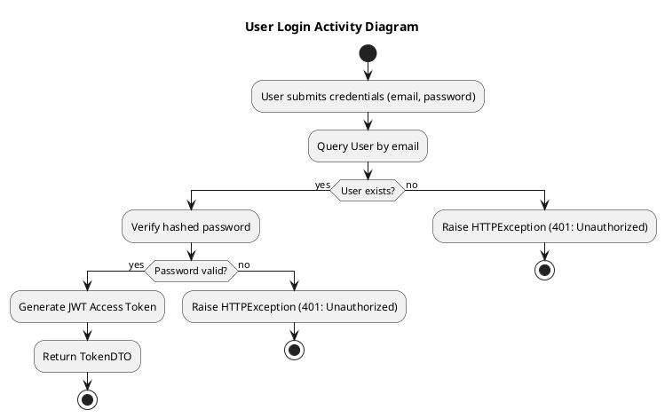
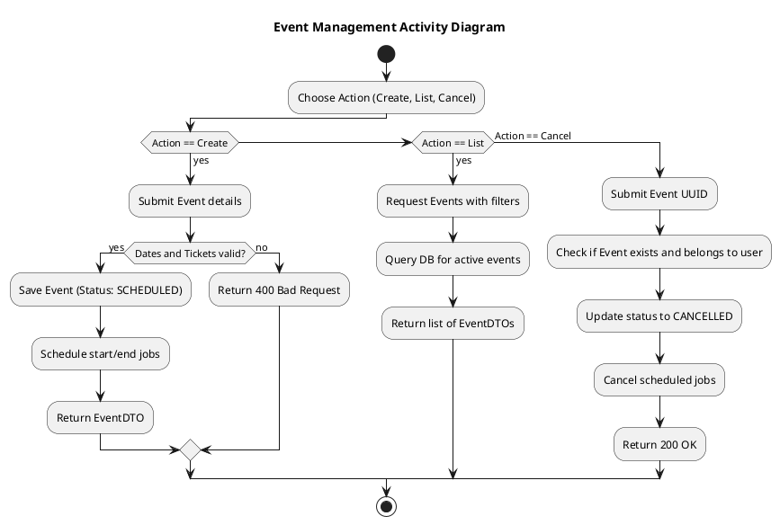
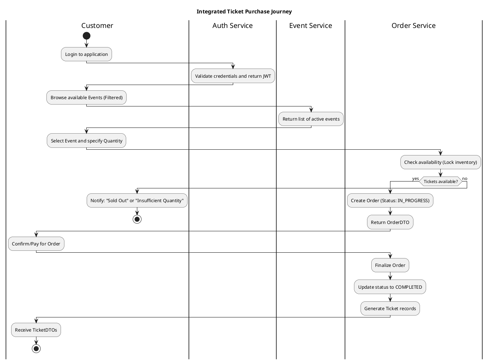
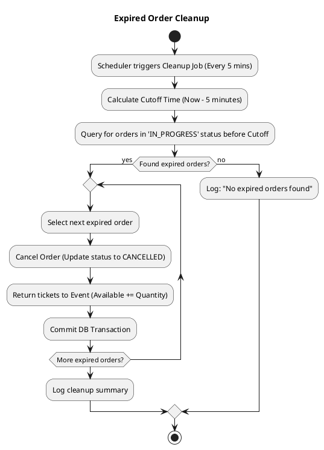

# Activity Diagrams

This document contains Activity Diagrams representing the operational flows of the "You Want Ticket" system, organized by complexity levels.

---

## Version 1: Core User & Event CRUD
This version focus on the basic administrative and user account management flows.

### 1.1 User Registration

### 1.2 User Login

### 1.3 Event Management (CRUD)

---

## Version 2: Integrated Purchase Flow
This version combines authentication, event discovery, and the ticketing lifecycle into a single user journey.

---

## Version 3: Advanced System Tasks
This version includes background maintenance and automated state transitions.

### 3.1 Expired Order Cleanup (Background Task)

### Key Workflow Principles
- **Identity First:** Most operations (except registration/login) require a valid JWT.
- **Inventory Locking:** Tickets are temporarily "locked" during the `IN_PROGRESS` order phase.
- **Fail-Safe Cleanup:** Background processes ensure data consistency if users abandon their carts.
- **State Driven:** Events and Orders move through strictly defined enums (SCHEDULED, ACTIVE, COMPLETED, CANCELLED).
