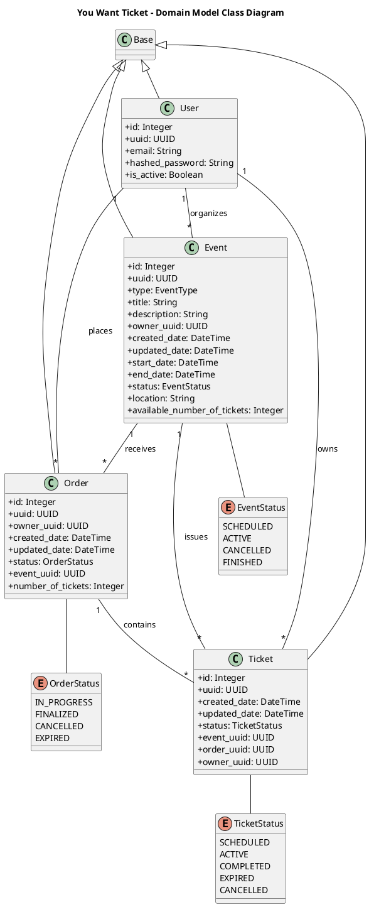
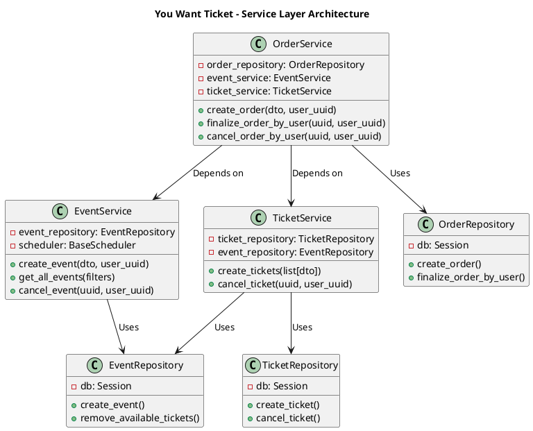

# Class Diagrams

This document illustrates the internal structure and static relationships of the "You Want Ticket" system using PlantUML Class Diagrams.

## 1. Domain Models and Relationships
The following diagram shows the core SQLAlchemy models, their attributes, and how they relate to each other through foreign keys.

---

## 2. Service Layer and Dependency Injection
This diagram illustrates the architectural pattern used for business logic, showing how Services depend on Repositories and other Services.

### Key Structural Patterns
- **Inheritance:** All models inherit from the `Base` class (Declarative Base), providing SQLAlchemy ORM capabilities.
- **Composition:** Services are composed of their respective repositories and other services they need to interact with.
- **Enumerations:** Distinct enums (`EventStatus`, `OrderStatus`, `TicketStatus`) are used to strictly define the state transitions of the domain objects.
- **Decoupling:** The Repository classes encapsulate the database access logic (SQLAlchemy sessions), keeping the Service layer focused on business rules.
