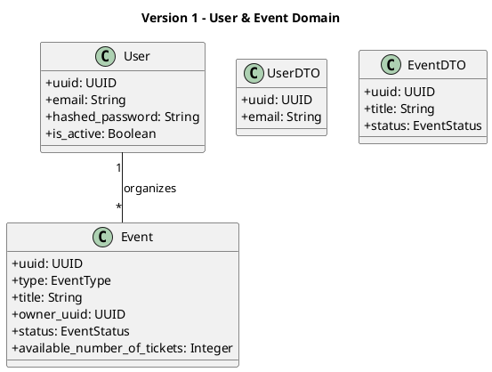
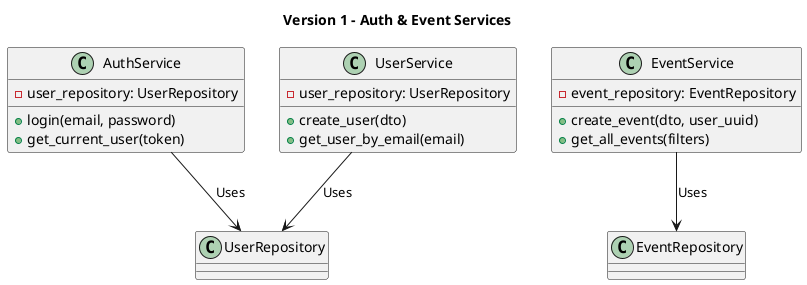
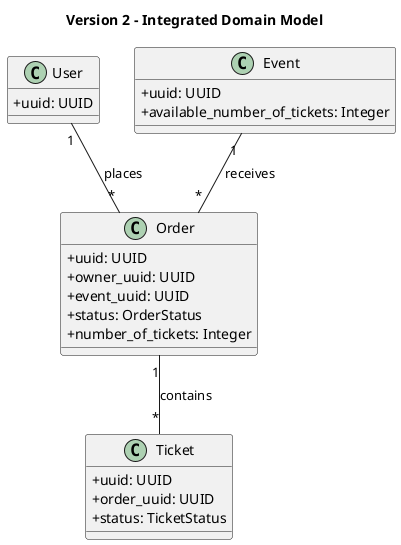
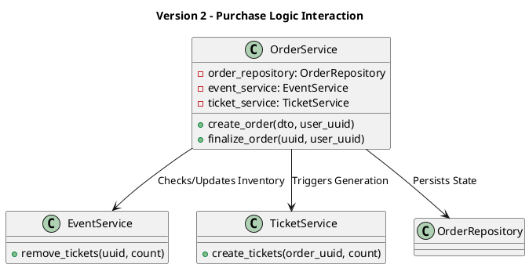
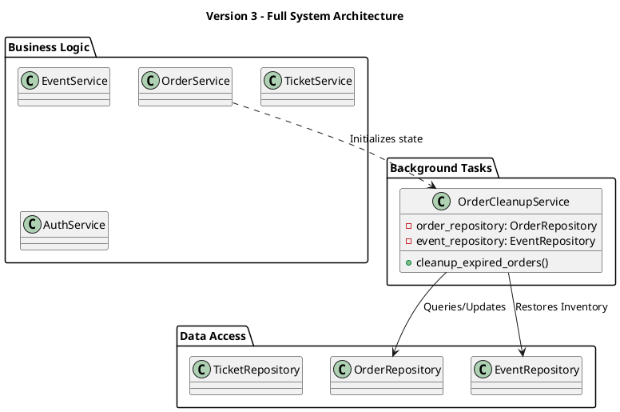

# Class Diagrams

This document illustrates the internal structure and static relationships of the "You Want Ticket" system, organized by complexity levels.

---

## Version 1: Core User & Event Structure
This version focuses on user authentication and event management, excluding orders and tickets.

### 1.1 Domain Models & DTOs

### 1.2 Service Layer Architecture

---

## Version 2: Integrated Ticketing System
This version adds the Order and Ticket domains and shows how the services interact to process purchases.

### 2.1 Complete Domain Model

### 2.2 Integrated Service Layer

---

## Version 3: Full System & Background Tasks
The complete architecture including maintenance services and advanced state management.

### 3.1 Advanced Service Architecture

### Key Structural Principles
- **Dependency Inversion:** Services depend on repositories (abstractions of data access).
- **Service Orchestration:** `OrderService` acts as an orchestrator for complex cross-domain logic.
- **Separation of Concerns:** Background services handle long-running or periodic maintenance tasks without blocking the main API flows.
- **DTO Usage:** Data Transfer Objects are used consistently for all API boundaries.
