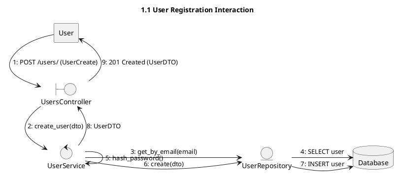
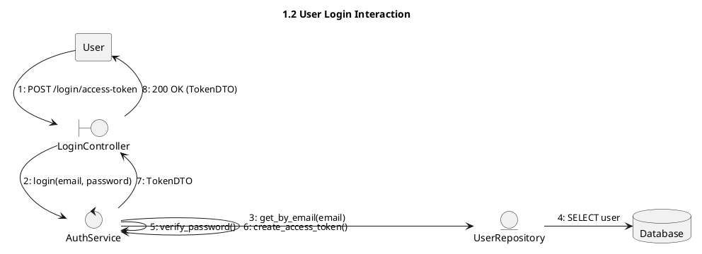
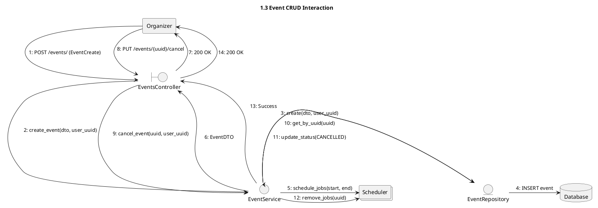
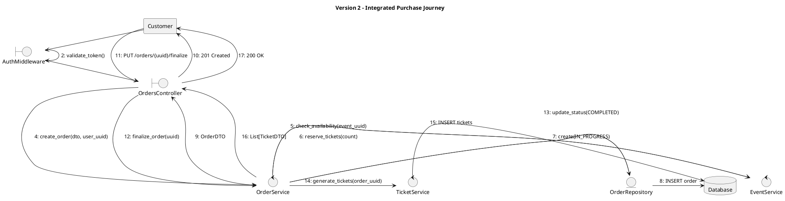
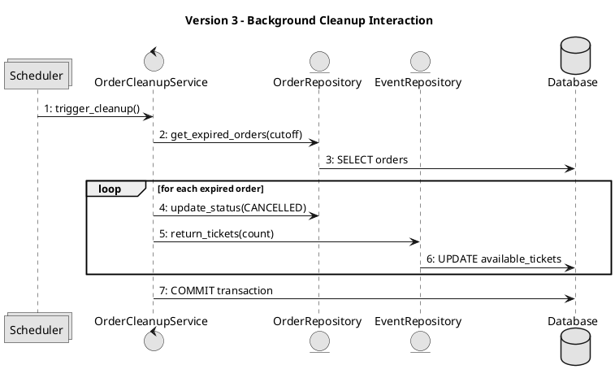

# Communication Diagrams

This document illustrates the interactions between system components for key workflows, organized by complexity levels.

---

## Version 1: Core User & Event Interactions
This version covers basic identity management and event administration.

### 1.1 User Registration

### 1.2 User Login

### 1.3 Event Management (CRUD)

---

## Version 2: Integrated Purchase Flow
This version shows the end-to-end communication required for a ticket purchase, including authentication verification.

---

## Version 3: Advanced System Tasks
This version focuses on automated background communication.

### 3.1 Expired Order Cleanup (Background)

### Key Interaction Principles
- **Stateless Auth:** Auth middleware validates the JWT for every protected request before it reaches the controller.
- **Service-to-Service:** Complex operations (like ordering) require the orchestrator service (`OrderService`) to communicate with domain services (`EventService`, `TicketService`).
- **Asynchronous Tasks:** The `Scheduler` acts as an external trigger for background service logic, which operates independently of user requests.
