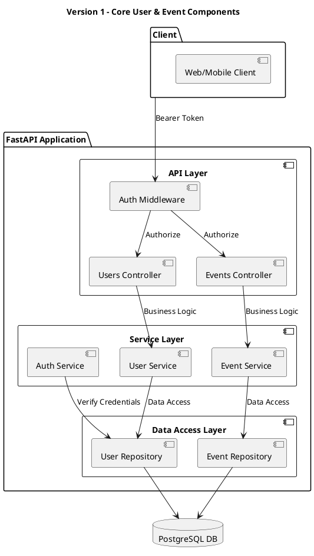
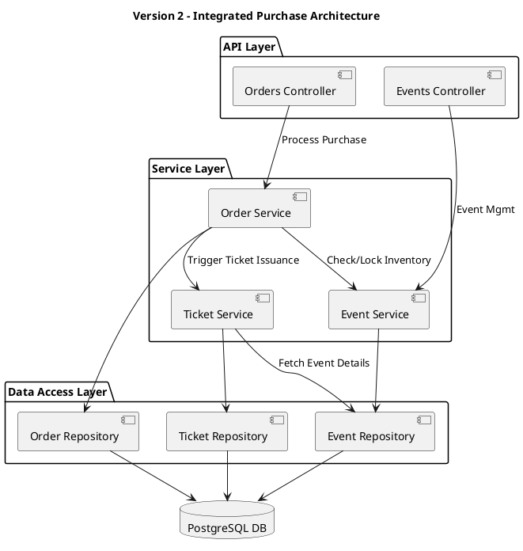
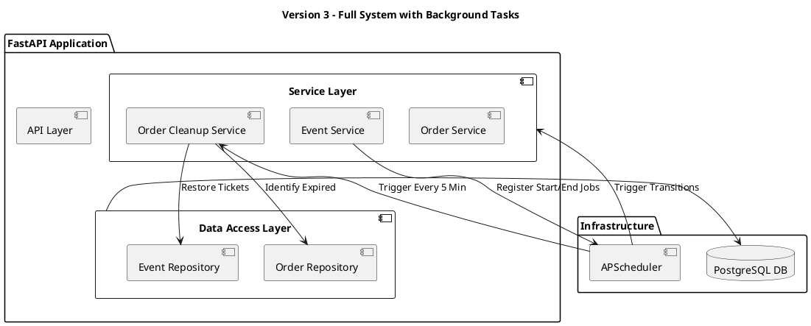

# Component Diagrams

This document illustrates the structural architecture of the "You Want Ticket" system, organized by complexity levels.

---

## Version 1: Core User & Event Architecture
This version focuses on the basic administrative and identity management layers, excluding ticketing and orders.

---

## Version 2: Integrated Ticketing System
This version introduces the purchase lifecycle, showing how the Order and Ticket components integrate with the existing services.

---

## Version 3: Full System Architecture
The complete system, including background maintenance services and external job scheduling.

### Component Breakdown
- **API Layer:** Handles request routing, parameter validation, and security (JWT).
- **Service Layer:** Orchestrates business rules. In the full system, it includes **Orchestrators** (OrderService) and **Background Services** (OrderCleanupService).
- **Data Access Layer (DAL):** Decouples the service logic from SQLAlchemy and the database schema.
- **Infrastructure:**
    - **APScheduler:** Manages the lifecycle of events and ensures unfinalized orders are cleaned up automatically.
    - **PostgreSQL:** The single source of truth for all persistent data.
