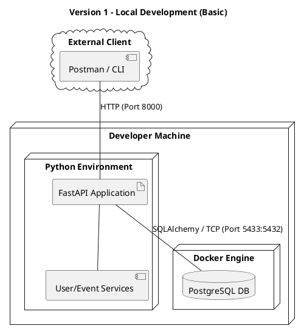
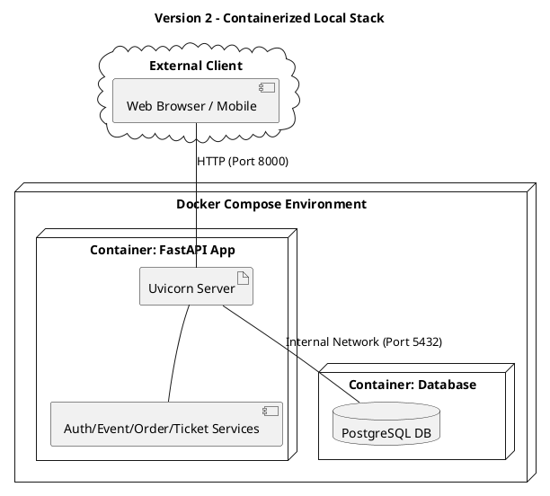
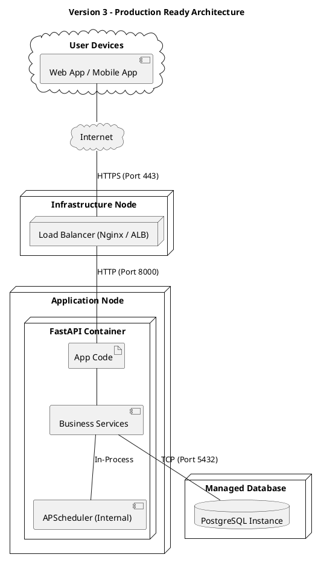

# Deployment Diagrams

This document illustrates the physical deployment architecture of the "You Want Ticket" system, organized by complexity levels.

---

## Version 1: Core Development Deployment
This version represents the initial local setup focused on User and Event management.

---

## Version 2: Integrated Development (Docker Compose)
This version containerizes the entire stack and includes the integrated ticketing and order flows.

---

## Version 3: Full System & Production Readiness
The final architecture including background task execution (internal scheduler) and production infrastructure components.

### Deployment Details
- **Environment Management:** Python dependencies are managed via `.venv`, and configuration is handled via environment variables (Pydantic Settings).
- **Process Context:** The **APScheduler** runs as a background thread within the FastAPI process (internal), ensuring it has direct access to the application context and database sessions.
- **Networking:** Development uses Port 5433 (mapping to 5432), while production uses standard internal networking or managed service endpoints.
- **Security:** Production environments enforce HTTPS at the Load Balancer level before traffic enters the Application Node.
