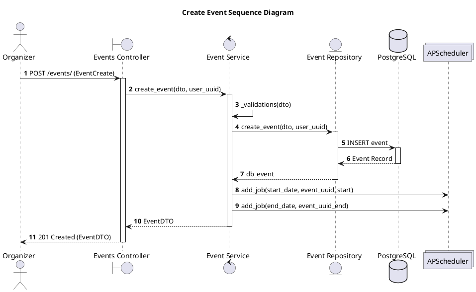
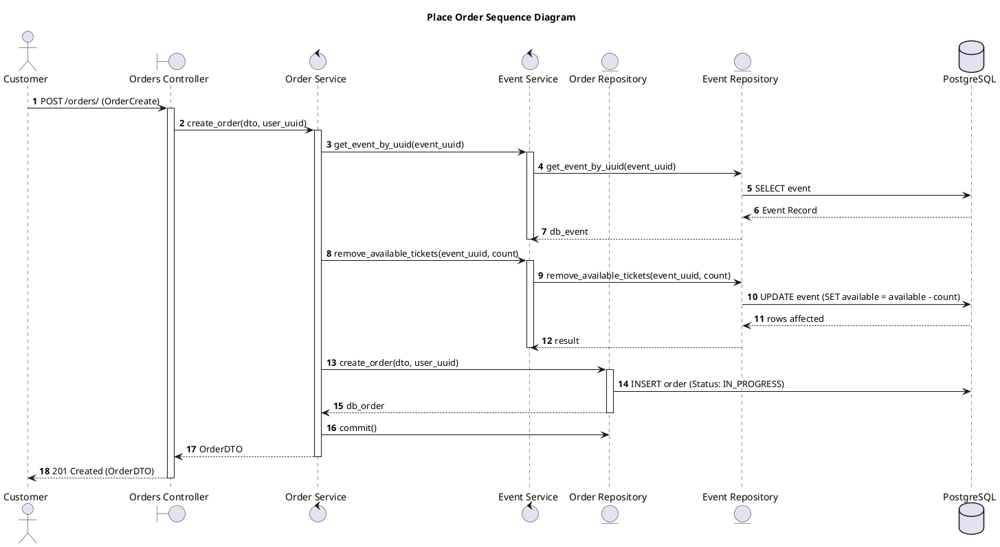
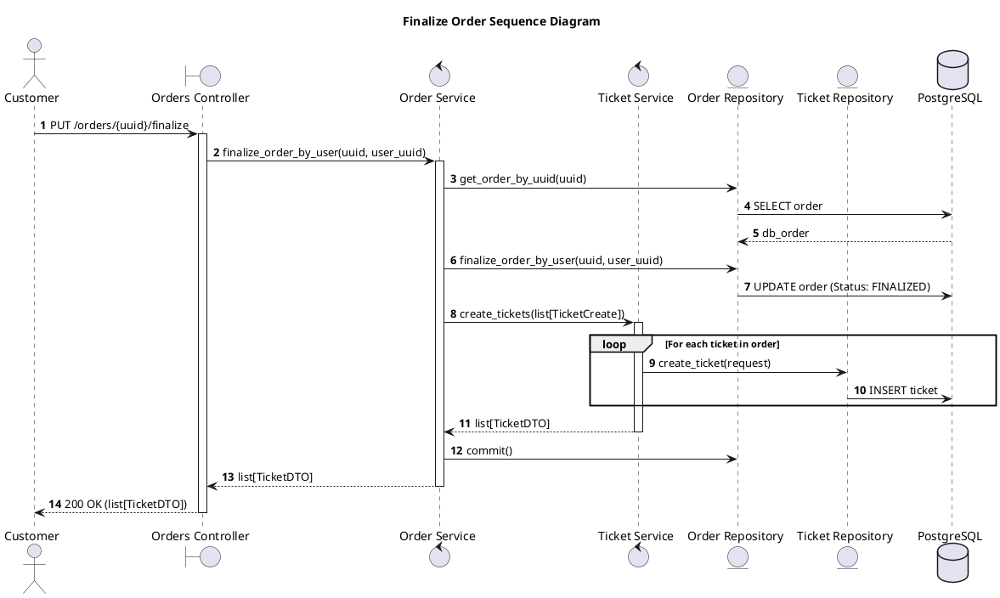

# Sequence Diagrams

This document illustrates the step-by-step interaction between objects for key workflows in the "You Want Ticket" system using PlantUML Sequence Diagrams.

## 1. Create Event (Organizer Workflow)
This diagram shows the sequence of calls from the moment an organizer submits a new event until it is persisted and scheduled.

---

## 2. Place Order (Customer Workflow)
This diagram shows how a customer reserves tickets for an event. It highlights the inventory management (decrementing tickets) and order creation.

---

## 3. Finalize Order (Customer Workflow)
This diagram illustrates the process of completing a purchase, which triggers the generation of unique tickets.

### Key Interaction Details
- **Transaction Scope:** Each high-level service call (like `create_order` or `finalize_order`) is responsible for committing or rolling back the database transaction to ensure data consistency.
- **Service Orchestration:** `OrderService` acts as an orchestrator, coordinating calls between `EventService` (for inventory) and `TicketService` (for generation).
- **Asynchronous Actions:** The `APScheduler` is invoked during event creation to handle future state changes independently of the request/response cycle.
