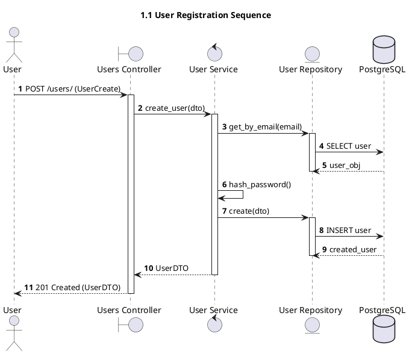
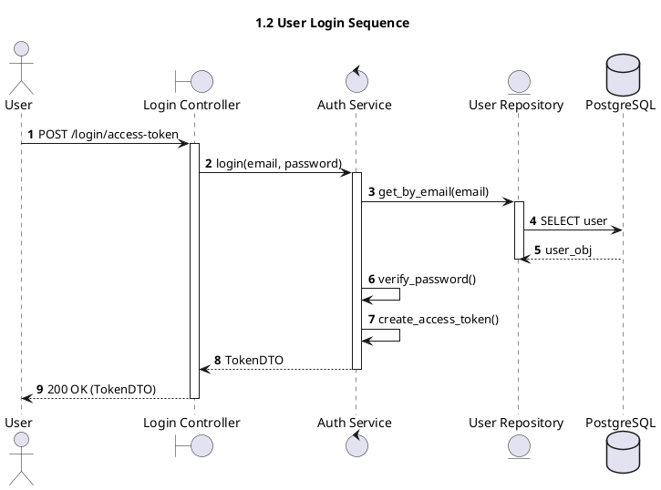
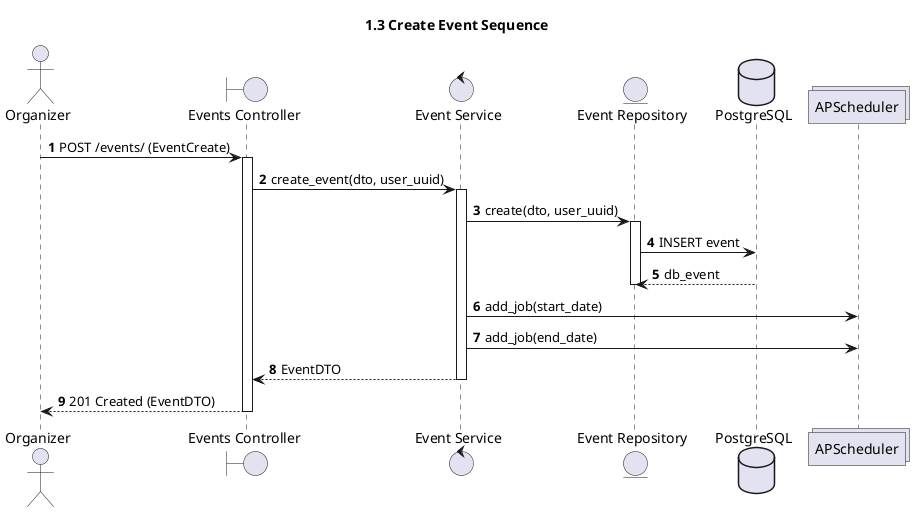
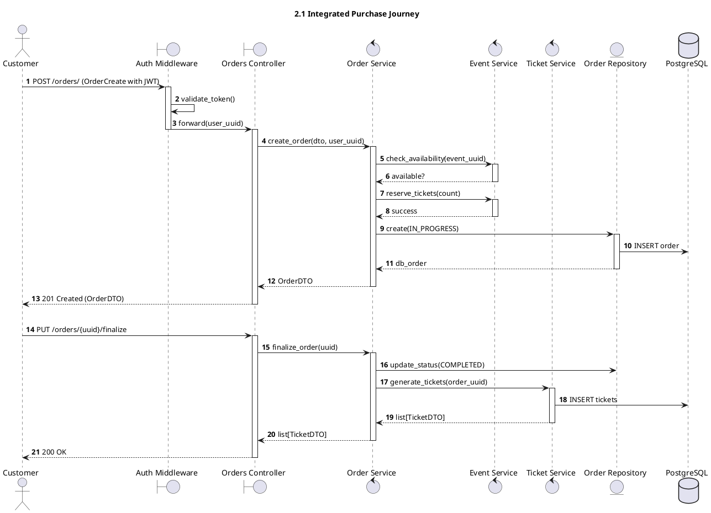
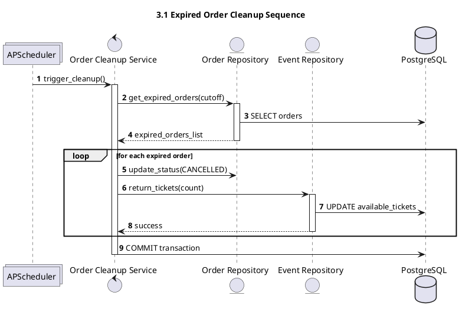
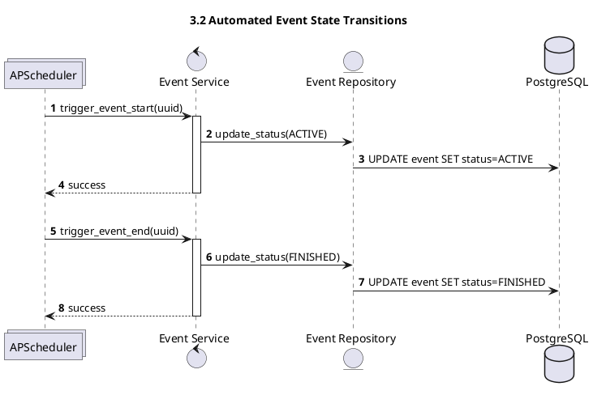

# Sequence Diagrams

This document illustrates the step-by-step interaction between system components for key workflows, organized by complexity levels.

---

## Version 1: Core User & Event Sequences
This version focuses on identity management and basic administrative flows.

### 1.1 User Registration

### 1.2 User Login

### 1.3 Create Event

---

## Version 2: Integrated Purchase Journey
This version shows the end-to-end ticketing lifecycle, including authentication verification.

### 2.1 Complete Purchase Flow

---

## Version 3: Advanced Background Operations
This version covers automated system tasks like cleanup and scheduled transitions.

### 3.1 Expired Order Cleanup

### 3.2 Automated Event State Transitions

### Key Interaction Details
- **Auth Verification:** All protected endpoints in Versions 2 and 3 explicitly include the `Auth Middleware` token validation step.
- **Orchestration:** The `OrderService` coordinates complex multi-service tasks, ensuring that state is only persisted upon successful completion of all sub-tasks.
- **Async Triggers:** Background tasks are initiated by the `APScheduler` but executed within the service layer to maintain domain logic consistency.
