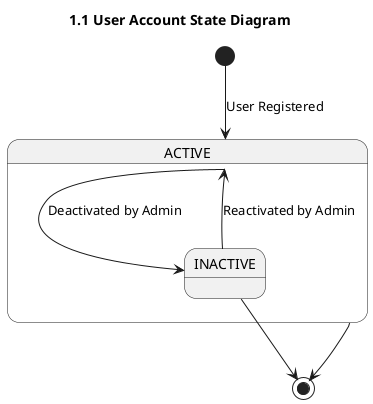
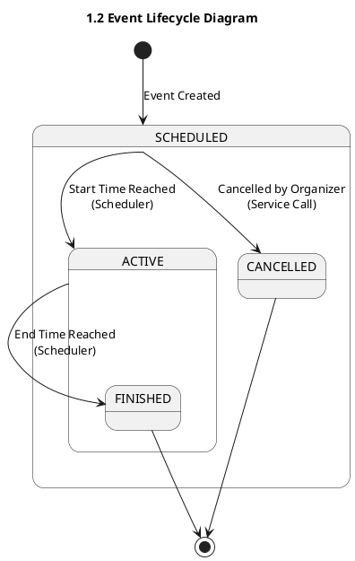
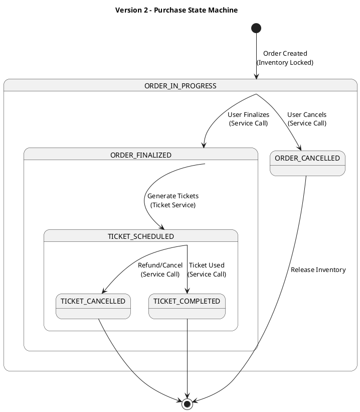
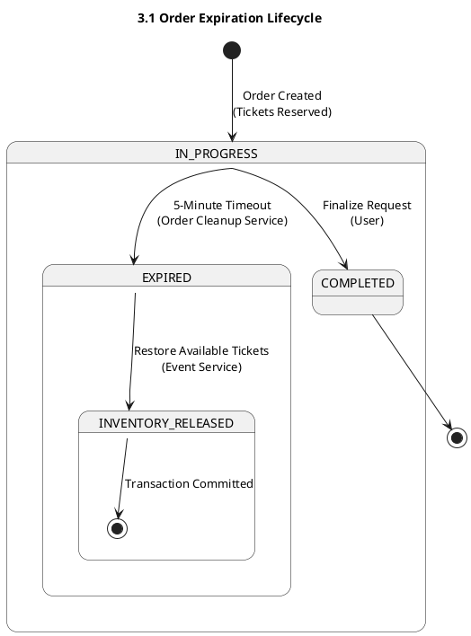
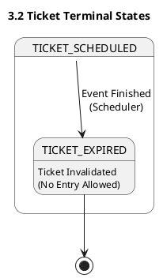

# State Diagrams

This document illustrates the lifecycles of core entities in the "You Want Ticket" system, organized by complexity levels.

---

## Version 1: Core User & Event Lifecycles
This version focuses on the basic activation states for users and the scheduling of events.

### 1.1 User Account State

### 1.2 Event Lifecycle

---

## Version 2: Integrated Purchase State Machine
This version illustrates the interconnected lifecycles of Orders and Tickets during a successful purchase.

---

## Version 3: Advanced Failure & Cleanup States
The final state model focusing on automated cleanup, timeout handling, and inventory resolution.

### 3.1 Order Expiration & Recovery

### 3.2 System Terminal States

### State Transition Logic
- **Event Transitions:** Managed by `APScheduler` in `EventService`. Status updates are atomic database operations.
- **Order Expiration:** The `OrderCleanupService` runs every 5 minutes, identifying `IN_PROGRESS` orders older than 5 minutes and transitioning them to `EXPIRED`.
- **Inventory Restoration:** When an order enters the `EXPIRED` or `CANCELLED` state, a service call automatically increments the event's `available_number_of_tickets`.
- **User States:** Managed via the `is_active` boolean in the `User` model, affecting the `AuthService` login flow.
