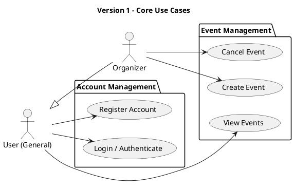
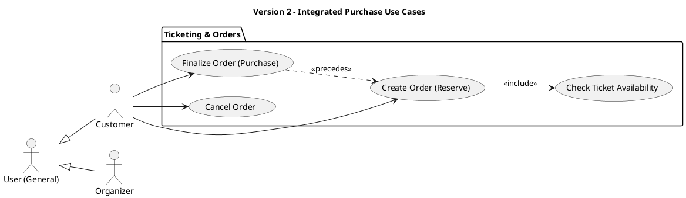
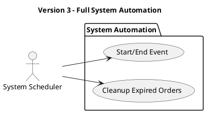

# Use Case Diagrams

This document illustrates the functional requirements of the "You Want Ticket" system, organized by complexity levels.

---

## Version 1: Core User & Event Management
This version focuses on account management and basic event administration for organizers.

### Version 1 Use Case Descriptions
- **Register Account:** A new user provides an email and password to create an account.
- **Login / Authenticate:** A user logs in to receive a JWT token for authorized requests.
- **View Events:** Users can browse all events with optional filters (date, location, type).
- **Create Event:** Organizers define new events, specifying dates and ticket capacity.
- **Cancel Event:** Organizers can cancel their own scheduled events.

---

## Version 2: Integrated Ticketing & Orders
This version introduces the Customer role and the complete ticket reservation and purchase flow.

### Version 2 Use Case Descriptions
- **Create Order (Reserve):** A customer selects an event and quantity. The system reserves the tickets for 5 minutes.
- **Finalize Order (Purchase):** Within the 5-minute window, the customer confirms the order, and the system generates unique tickets.
- **Cancel Order:** A customer manually cancels an "In Progress" order, returning tickets to the event inventory.
- **Check Ticket Availability:** An internal check performed whenever a new order is requested to ensure inventory exists.

---

## Version 3: Advanced System Automation
The final version includes the background scheduler tasks for automated state management.

### Version 3 Use Case Descriptions
- **Start/End Event (System):** The background scheduler automatically updates event status (to ACTIVE or FINISHED) based on the configured times.
- **Cleanup Expired Orders (System):** A background task automatically cancels orders that have exceeded the 5-minute reservation window, releasing inventory.

---

### Actor Definitions
- **User (General):** Any person using the system (Registration/Login/Viewing).
- **Customer:** A user who reserves and purchases tickets.
- **Organizer:** A user who hosts and manages events.
- **System Scheduler:** An internal actor (APScheduler) responsible for time-triggered state changes.
