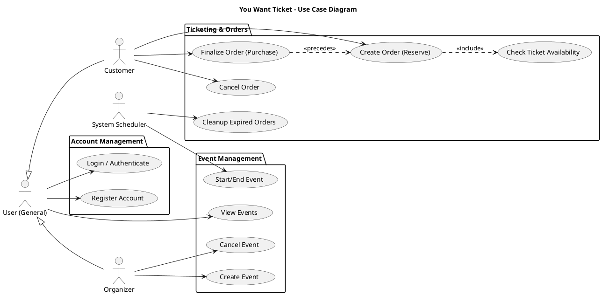

# Use Case Diagrams

This document illustrates the functional requirements of the "You Want Ticket" system from the perspective of different users and the system itself.

## 1. System Use Case Diagram
This diagram shows the primary actors (Organizer, Customer, and System) and their interactions with the system's core features.

---

## Use Case Descriptions

### 1. Account Management
- **Register Account:** A new user provides an email and password to create an account.
- **Login / Authenticate:** A user logs in to receive a JWT token for authorized requests.

### 2. Event Management
- **View Events:** Users can browse all events with optional filters (date, location, type).
- **Create Event:** Organizers define new events, specifying dates and ticket capacity.
- **Cancel Event:** Organizers can cancel their own scheduled events.
- **Start/End Event (System):** The background scheduler automatically updates event status based on the configured start and end times.

### 3. Ticketing & Orders
- **Create Order (Reserve):** A customer selects an event and quantity. The system reserves the tickets (decrementing inventory) for 5 minutes.
- **Finalize Order (Purchase):** Within the 5-minute window, the customer confirms the order, and the system generates unique tickets.
- **Cancel Order:** A customer manually cancels an "In Progress" order, returning tickets to the event inventory.
- **Cleanup Expired Orders (System):** A background task automatically cancels orders that have exceeded the 5-minute reservation window.
- **Check Ticket Availability:** This is an internal check performed whenever a new order is requested.

---

### Actor Definitions
- **User (General):** Any authenticated person using the system.
- **Customer:** A user primarily interested in finding events and purchasing tickets.
- **Organizer:** A user who hosts events and manages ticket availability.
- **System Scheduler:** An internal actor (APScheduler) responsible for time-triggered state changes and cleanup tasks.
